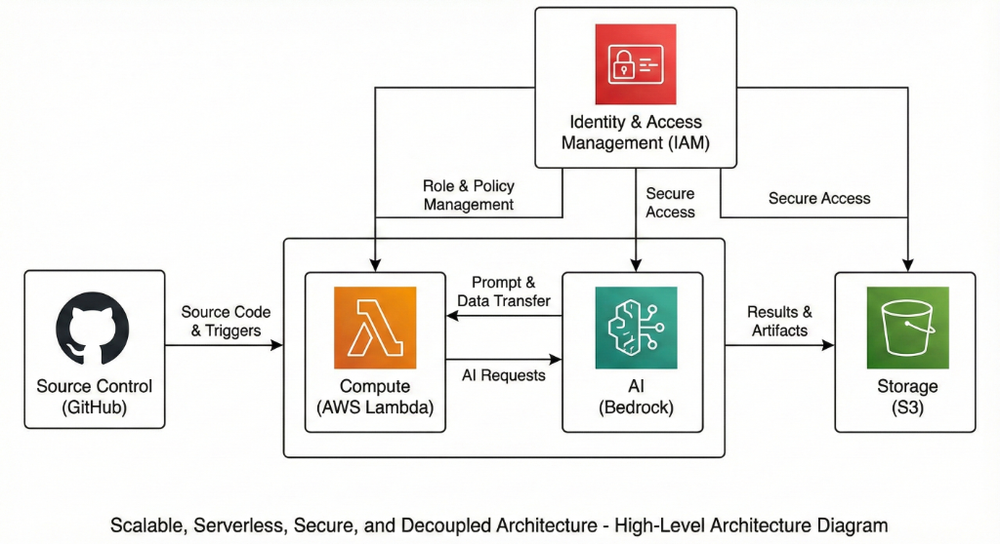
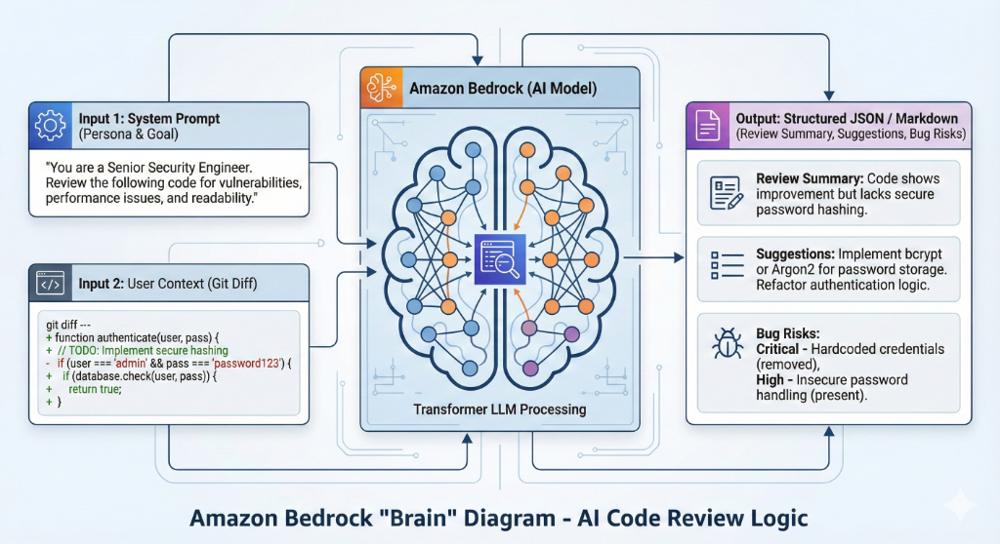
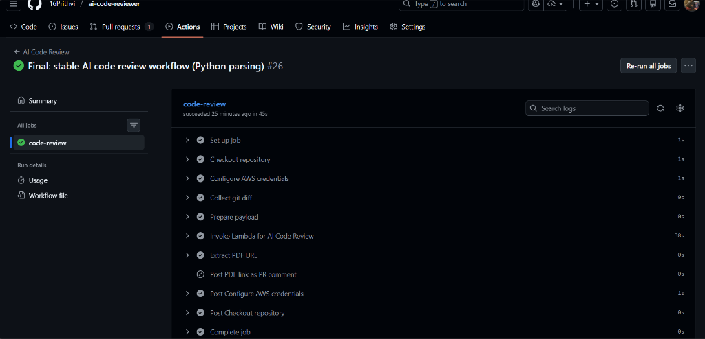

# 🚀 AI-Powered Code Review Automation System

An end-to-end, serverless, and automated code review pipeline seamlessly integrated into GitHub Actions. This project leverages **AWS components** and **Generative AI (Amazon Bedrock)** to provide intelligent, contextual, and secure code analysis for every pull request.



---

## 📖 Overview

In modern DevSecOps workflows, manual code reviews can be a bottleneck. This project solves that by automating the initial pass of code review using AI.  

Whenever a developer pushes code or opens a Pull Request (PR), the system automatically:
1.  **Captures the Diff**: GitHub Actions extracts the changes.
2.  **Analyzes with AI**: A secured AWS Lambda function invokes Amazon Bedrock to review the code against security, performance, and quality standards.
3.  **Generates a Report**: A comprehensive PDF report is generated and stored in S3.
4.  **Notifies the Developer**: The PR is commented on with a direct link to the review report.

This ensures that every line of code is reviewed for **OWASP Top 10 vulnerabilities**, **clean code principles**, and **optimization opportunities** before it even reaches a human reviewer.

---

## 🏗 Architecture

The system is built on a **fully serverless, event-driven architecture** ensuring scalability and low maintenance.


### Key Components:
-   **GitHub Actions**: Orchestrates the CI/CD workflow, capturing git diffs and triggering the analysis.
-   **AWS Lambda**: The compute engine that processes the diff and interacts with the AI model.
-   **Amazon Bedrock**: The generative AI engine (using Claude or Titan models) providing deep code analysis.
-   **Amazon S3**: Secure storage for the generated PDF reports.
-   **AWS IAM**: Granular permission management to ensure least-privilege access between services.

---

## 🧠 AI Review Logic

The core intelligence lies in how the AI model processes context. We don't just send raw code; we send a structured prompt combining **System Persona** (Senior Security Engineer) and **User Context** (Git Diff).



The AI evaluates:
-   **Security**: Hardcoded credentials, injection risks, insecure dependencies.
-   **Performance**: O(n^2) loops, memory leaks, inefficient queries.
-   **Maintainability**: SOLID principles, function complexity, naming conventions.

---

## 📸 Workflow & Demo

### 1. Automated Trigger
Start by opening a Pull Request. The GitHub Action kicks off immediately.


### 2. Intelligent Commenting
Within seconds, the AI posts a comment on your PR with a secure link to the detailed report.



### 3. Comprehensive Reports
The PDF reports are archives in Amazon S3, accessible via presigned URLs or direct console access for auditors.


---

## 🛠 Tech Stack

-   **Cloud Provider**: AWS (Lambda, S3, IAM, Bedrock)
-   **CI/CD**: GitHub Actions
-   **AI Model**: Amazon Bedrock (Claude 3 / Titan)
-   **Language**: Python (Boto3, PDF generation)
-   **Infrastructure**: Serverless

## 🚀 Getting Started

### Prerequisites
-   AWS Account with Bedrock access enabled.
-   GitHub Repository.

### Installation
1.  **Clone the Repo**
    ```bash
    git clone https://github.com/your-username/ai-code-reviewer.git
    ```
2.  **Deploy AWS Infrastructure**
    -   Create S3 Bucket.
    -   Deploy Lambda Function (upload code from `src/`).
    -   Configure IAM Roles.
3.  **Configure GitHub Secrets**
    -   `AWS_ACCESS_KEY_ID`
    -   `AWS_SECRET_ACCESS_KEY`
    -   `AWS_REGION`
    -   `S3_BUCKET_NAME`

---

*This project demonstrates the power of combining cloud-native serverless infrastructure with modern AI capabilities to enhance developer's productivity.*
